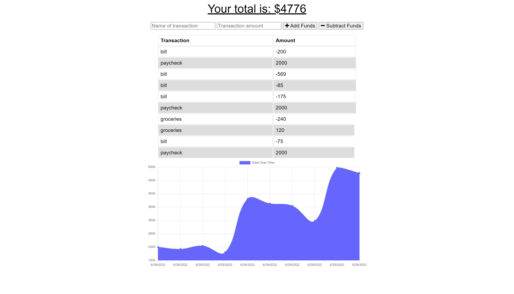

# 19 Progressive Web Applications (PWA): Budget Tracker

## Description

Giving users a fast and easy way to track their money is important, but allowing them to access that information at any time is even more important. Having offline functionality is paramount to the success of an application that handles users’ financial information.

I've added functionality to an existing budget tracker application to allow for offline access and functionality. The user will be able to add expenses and deposits to their budget with or without a connection. When entering transactions offline, they should update the total when brought back online.

&nbsp;

---
## User Story

```md
AS AN avid traveller
I WANT to be able to track my withdrawals and deposits with or without a data/internet connection
SO THAT my account balance is accurate when I am traveling 
```

&nbsp;

---
## Usage

* Simply click on the Deployed Heroku APP link to get started.  

* Give it a try!  Input the transaction's name, amount, and then click the respective button to add or substract funds.


&nbsp;

---
## Links

[GitHub Repository](https://github.com/MorningSol/pwa-budget-tracker)

[Deployed Heroku APP](https://immense-basin-46853.herokuapp.com/)

&nbsp;

---
## Application Demonstration

&nbsp;




